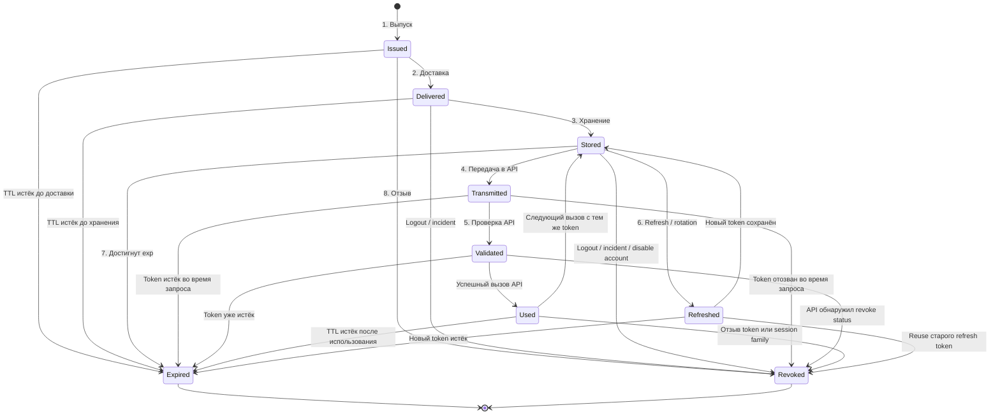

# План обучения: Token Lifecycle Lab

**Token Lifecycle Lab** — локальная учебная утилита: сначала интерактивный CLI на Go, затем Web UI на чистом HTML/CSS/JavaScript, затем наблюдение за токенами в браузере. Каждый этап — самостоятельная завершённая версия, поэтому проект можно остановить без ощущения незаконченности.

Цель проекта двойная:

- Понять жизненный цикл токенов: от выдачи до истечения, ротации, отзыва и мониторинга.
- Изучить Go, затем чистый HTML/CSS/JavaScript и основы взаимодействия с браузером на реальном, постепенно растущем проекте.

Технологическая граница проекта:

| Часть                   | Технология                 | Роль                                                                     |
| ----------------------- | -------------------------- | ------------------------------------------------------------------------ |
| Backend и доменное ядро | Go                         | Модель токенов, lifecycle, CLI, browser connector, локальный HTTP-сервер |
| Frontend                | Чистые HTML/CSS/JavaScript | Визуализация timeline, карточки токенов, live-обновления                 |
| Хранение на старте      | Только память процесса     | Никаких БД до появления реальной потребности                             |
| Интеграции              | Позже: Chrome/Chromium     | Чтение доступных browser storage и наблюдение изменений                  |
| Сеть                    | Отсутствует до `v0.4`      | Первые версии полностью локальны и автономны                             |

---

## 1. Базовая теория

### Что такое токен

**Токен** — это доказательство того, что клиенту разрешено выполнить определённое действие в течение ограниченного времени и с определёнными правами.

Обычно до выпуска есть предварительный шаг — **запрос доступа**: login, OAuth authorization flow, предъявление API key или machine-to-machine authentication. Но сам жизненный цикл уже выпущенного токена удобнее рассматривать через восемь стадий ниже.

Примеры:

| Тип                | Где встречается                | Что представляет                                                         |
| ------------------ | ------------------------------ | ------------------------------------------------------------------------ |
| Access token       | API, SPA, mobile               | Краткоживущее право вызвать защищённый API                               |
| Refresh token      | OAuth/OIDC                     | Право получить новую пару токенов без повторного логина                  |
| JWT                | API, Identity Provider         | Самодостаточный подписанный токен с claims                               |
| Opaque token       | OAuth/OIDC                     | Непрозрачная случайная строка; статус известен только серверу            |
| API key            | Интеграции, service-to-service | Долгоживущий секрет для идентификации клиента                            |
| Session cookie     | Классические web-приложения    | Идентификатор серверной сессии в cookie                                  |
| Authorization code | OAuth redirect flow            | Одноразовый короткоживущий код для обмена на токены; это не access token |

JWT может локально сообщить, кем и когда он был выпущен, когда истекает и какие claims содержит. Но JWT сам по себе не может достоверно сообщить, был ли он отозван сервером после выпуска: для этого нужна проверка у сервера авторизации, deny-list либо короткий срок жизни. OAuth introspection предназначен именно для запроса текущей активности токена и его метаданных. [rfc-editor](https://www.rfc-editor.org/rfc/rfc7662.txt)

### Главный принцип безопасности

Подпись JWT защищает его содержимое от **подмены**, но не защищает сам токен от **кражи**. Украденный bearer token обычно выглядит для API так же, как легитимный: обе стороны предъявляют одинаковую строку.

Поэтому безопасность определяется не только алгоритмом подписи JWT, но всей цепочкой:

```text
Как выпущен → где хранится → как передаётся → как проверяется
→ как обновляется → как ротируется → как истекает/отзывается → как наблюдается
```

### Восемь стадий жизни

Это не восемь обязательных технических состояний каждого стандарта, а удобная **единая учебная модель**.

|   № | Стадия                       | Что происходит                                                                                              | Что видит клиент/API                                                        |
| --: | ---------------------------- | ----------------------------------------------------------------------------------------------------------- | --------------------------------------------------------------------------- |
|   1 | **Выпуск**                   | Сервер создаёт token: ID, claims, scopes, `iat`, `nbf`, `exp`, подпись или opaque value                     | Токен создан и возвращён клиенту                                            |
|   2 | **Доставка**                 | Token передаётся клиенту: response body, защищённая cookie, OAuth redirect с code                           | Здесь token может утечь при неправильном потоке или transport               |
|   3 | **Хранение**                 | Клиент или сервер хранит credential: memory, storage, cookie, server session                                | Определяется, кто способен прочитать и использовать token                   |
|   4 | **Передача**                 | Token уходит в `Authorization: Bearer ...` либо browser автоматически отправляет cookie                     | API получает credential                                                     |
|   5 | **Проверка и использование** | API проверяет подпись/issuer/audience/время/scopes/статус и выполняет запрос                                | `200`, `401` или `403`; token может использоваться многократно до конца TTL |
|   6 | **Обновление и ротация**     | Refresh token выдаёт новый access token; при rotation старый refresh token становится недействительным      | Появляется новая token pair или новый credential                            |
|   7 | **Истечение**                | Достигается `exp` или заканчивается TTL                                                                     | API прекращает принимать token                                              |
|   8 | **Отзыв и завершение**       | Logout, компрометация, смена пароля, отключение аккаунта или ручной revoke досрочно запрещают token/session | Даже неистёкший token становится недействительным                           |

**Мониторинг и аудит** — не девятая стадия. Это сквозной слой, который наблюдает все восемь: выпуск, хранение, применение, refresh, повторное использование, expiry и revoke.



### Два примера

- **Пример 1 — обычный login в web-приложение**

```text
Login
→ access token на 15 минут + refresh token на 7 дней
→ token хранится в выбранной модели browser/session storage
→ access token передаётся к API
→ API валидирует его и выполняет запрос
→ через 15 минут access token истёк
→ refresh token выдаёт новый access token
→ при logout или инциденте сессия/refresh token отзываются
```

- **Пример 2 — API key интеграции**

```text
Администратор создаёт API key для внешнего сервиса
→ ключ безопасно передаётся владельцу один раз
→ владелец сохраняет его в secret storage
→ сервис вызывает API этим ключом
→ ключ работает в рамках TTL или до ручной ротации
→ ключ скомпрометирован или больше не нужен
→ администратор отзывает его и выдаёт replacement
```

OAuth token revocation — стандартный механизм, позволяющий клиенту сообщить authorization server, что access или refresh token более не нужен; это применяется, например, для logout и сокращения окна компрометации. [rfc-editor](https://www.rfc-editor.org/info/rfc7009/)

---

## 2. Карта развития

| Версия | Результат                                                         | Цель обучения                               | Статус зависимости |
| ------ | ----------------------------------------------------------------- | ------------------------------------------- | ------------------ |
| `v0.1` | Интерактивный CLI-демо восьми стадий                              | Базовая модель токенов и основы Go CLI      | Старт              |
| `v0.2` | CLI-сценарии: expiry, refresh, rotation, revoke, storage и ошибки | Увидеть разницу между похожими состояниями  | После `v0.1`       |
| `v0.3` | JWT Inspector: вставка JWT и объяснение его claims                | Привязать модель к реальному токену         | После `v0.2`       |
| `v0.4` | Локальный Web UI с lifecycle timeline                             | Освоить HTTP в Go и vanilla JS/HTML/CSS     | После `v0.3`       |
| `v0.5` | Browser token discovery для выбранного браузера/домена            | Понять browser storage и DevTools Protocol  | После `v0.4`       |
| `v1.0` | Local real-time token observer: CLI + Web UI                      | Наблюдение изменений и единый поток событий | После `v0.5`       |

Правило: **не переходить к следующей версии, пока текущая не воспринимается как законченная утилита.**

---

## 3. Сценарии v0.2

В `v0.2` утилита всё ещё работает исключительно с моделью в памяти. Нет настоящего браузера, API, токенов пользователя и сетевых вызовов: только понятные симуляции.

| Сценарий              | Старт                                                 | Событие                                        | Итог                                         | Главный вывод                                                       |
| --------------------- | ----------------------------------------------------- | ---------------------------------------------- | -------------------------------------------- | ------------------------------------------------------------------- |
| Happy path            | Access token активен                                  | Успешный API-вызов                             | `active → used → active`                     | Использование не создаёт новый token                                |
| Expiry                | Token активен                                         | Время достигло `exp`                           | `active → expired`                           | Истечение происходит автоматически                                  |
| Token too early       | Token имеет `nbf` в будущем                           | API-проверка до `nbf`                          | Запрос отклонён                              | Выпущенный token может быть ещё невалиден                           |
| Refresh               | Access token почти истёк, refresh активен             | Клиент выполняет refresh                       | Новый access token                           | Refresh и access token — разные сущности                            |
| Refresh rotation      | Refresh token активен                                 | Успешный refresh                               | Новый refresh, старый недействителен         | Повторное использование старого refresh token подозрительно         |
| Refresh race          | Один refresh token, два параллельных refresh-запроса  | Две попытки consume                            | Разрешён только один                         | Ротация обязана быть атомарной                                      |
| Refresh reuse         | Старый уже consumed refresh token предъявлен повторно | Security event                                 | Сессия или family может быть отозвана        | Reuse — признак кражи, бага клиента или race condition              |
| Access rotation       | Token активен                                         | Плановая замена credential                     | Новый token, старый завершается              | Ротация снижает срок жизни секрета                                  |
| Explicit revoke       | Token активен                                         | Администратор отзывает его                     | `active → revoked`                           | Revoke не ждёт `exp`                                                |
| Revoke family         | Есть access + refresh одной сессии                    | Logout everywhere / incident                   | Все связанные tokens отозваны                | Отзыв бывает точечным и групповым                                   |
| Password changed      | Пользователь сменил пароль                            | Security policy                                | Активные сессии инвалидируются               | Смена credential может завершать старые sessions                    |
| Disabled account      | Account отключен администратором                      | Policy enforcement                             | Token больше не даёт доступ                  | Status account важнее валидной подписи JWT                          |
| Scope denied          | Token активен                                         | Вызов endpoint без нужного scope               | `403 Forbidden`                              | Token валиден, но прав недостаточно                                 |
| Invalid signature     | Token подменён                                        | API проверяет подпись                          | `401 Unauthorized`                           | Claims нельзя считать доверенными без подписи                       |
| Wrong issuer/audience | Token от другого IdP/API                              | API проверяет `iss`/`aud`                      | `401 Unauthorized`                           | Подписанный JWT не универсален                                      |
| Missing token         | Клиент не передал credential                          | Вызов API                                      | `401 Unauthorized`                           | Это не lifecycle token, а отсутствие аутентификации                 |
| Token too large       | JWT превышает заданный лимит                          | API отвергает вход                             | `401 Unauthorized`                           | Token нужен для авторизации, а не для хранения профиля пользователя |
| Token in URL          | Token передан как query parameter                     | URL попадает в history/logs/Referer            | Credential скомпрометирован                  | Access token никогда не должен быть в URL                           |
| Token in logs         | `Authorization` или `Cookie` записаны логгером        | Логи доступны шире auth-системы                | Возможная утечка                             | Секреты надо redaction-маскировать до записи                        |
| Storage local         | Token хранится в `localStorage`                       | Внедрённый JS читает storage                   | Возможна кража token                         | `localStorage` удобен, но доступен XSS                              |
| Storage session       | Token хранится в `sessionStorage`                     | Вкладка закрывается / XSS исполняется          | Token исчезает при закрытии, но доступен XSS | Закрытие вкладки не заменяет защиту от JS                           |
| Storage HttpOnly      | Session живёт в `HttpOnly` cookie                     | JS пытается прочитать cookie                   | Значение скрыто от JS                        | `HttpOnly` снижает риск эксфильтрации, но не отменяет XSS           |
| CSRF cookie           | Browser автоматически шлёт session cookie             | Внешний сайт инициирует state-changing request | Нужны SameSite/CSRF/origin controls          | Cookie auth требует защиты от CSRF                                  |
| Compromise response   | Token предположительно утёк                           | Security event                                 | Revoke/rotation/session termination          | Компрометация — причина действия, а не тип token                    |
| Opaque token          | Есть непрозрачная строка                              | Нужен status                                   | Запрос к issuer/introspection                | Без сервера opaque token не расшифровать                            |
| Honeytoken            | Приманка появляется в запросе                         | Detector фиксирует использование               | Alert + revoke session                       | Honeytoken — дополнительный сигнал, не защита вместо архитектуры    |

`localStorage` и `sessionStorage` одинаково доступны JavaScript данного origin, включая вредоносный код при XSS или компрометации dependency. `HttpOnly` cookie нельзя прочитать из JavaScript, но browser всё ещё может автоматически приложить её к запросу, поэтому XSS и CSRF остаются важными угрозами. [habr](https://habr.com/ru/companies/timeweb/articles/1077690/)

---

## 4. Реализация по версиям

### v0.1 — CLI Lifecycle Demo

**Результат:** команда запускает один заранее заданный сценарий. Каждое нажатие Enter переводит модель на следующую из восьми стадий и выводит короткое объяснение: что произошло, какие данные появились или изменились, что теперь сделает API.

| Направление            | Что изучается                                                                                                                                                          |
| ---------------------- | ---------------------------------------------------------------------------------------------------------------------------------------------------------------------- |
| Теория токенов         | Выпуск, доставка, хранение, передача, проверка, refresh, rotation, expiry, revoke; отличие token ID от значения token; TTL, claims, scopes, `jti`, `iat`, `nbf`, `exp` |
| Go                     | Структуры, интерфейсы только при реальной необходимости, enum-подобные константы, методы, пакеты, `main`, работа с stdin/stdout                                        |
| Проектирование         | Чистая доменная модель: `Token`, `TokenEvent`, `LifecycleState`, переходы состояний                                                                                    |
| Практический результат | Понятный консольный «мини-курс», который можно запускать и проходить за 2–3 минуты                                                                                     |
| Проверка готовности    | Нельзя перейти из `expired` или `revoked` обратно в `active`; каждая стадия объясняется одной-двумя ясными фразами                                                     |

В каждом шаге CLI должен отдельно отвечать на четыре вопроса:

1. Где token сейчас находится?
2. Может ли клиент его использовать?
3. Что проверит API?
4. Какое следующее допустимое событие возможно?

### v0.2 — Scenario Simulator

**Результат:** пользователь выбирает один из сценариев из таблицы выше. Утилита показывает, почему переход произошёл, какие проверки выполнены и какой ответ получил бы клиент.

| Направление            | Что изучается                                                                                                                                                    |
| ---------------------- | ---------------------------------------------------------------------------------------------------------------------------------------------------------------- |
| Теория токенов         | Refresh, rotation, revoke, validation, `401` против `403`, подпись, issuer, audience, token family, refresh reuse, token storage, bearer semantics, CSRF         |
| Go                     | Табличные сценарии, обработка пользовательского выбора, простые state machine, ошибки, unit-тесты переходов                                                      |
| Проектирование         | Разделение модели, сценария и renderer: сценарий меняет состояние; CLI только показывает его                                                                     |
| Безопасность           | Почему token нельзя помещать в URL и логи; почему `localStorage` и `sessionStorage` не защищают от XSS; чем `HttpOnly` отличается от JavaScript-readable storage |
| Практический результат | Набор интерактивных «лабораторных работ» по безопасности токенов                                                                                                 |
| Проверка готовности    | Каждый сценарий приводит к предсказуемому финалу и объясняет, почему другой исход невозможен                                                                     |

Отдельная учебная цель версии — закрепить различия:

| Пара понятий                       | Различие                                                                                                     |
| ---------------------------------- | ------------------------------------------------------------------------------------------------------------ |
| Expiry / revoke                    | Expiry происходит по времени; revoke — досрочное серверное решение                                           |
| Refresh / rotation                 | Refresh — выпуск новой пары или access token; rotation — замена старого reusable credential новым            |
| `401` / `403`                      | `401`: credential отсутствует, недействителен, истёк или отозван; `403`: token принят, но права недостаточны |
| Decode / verify                    | Decode читает JWT; verify подтверждает подпись и доверие к issuer                                            |
| Token theft / token tampering      | Кража использует исходный валидный token; tampering меняет claims и ломает signature                         |
| `localStorage` / `HttpOnly cookie` | Первый читается JS; второй не читается JS, но может автоматически отправляться браузером                     |
| Access token / refresh token       | Первый вызывает API; второй нужен для получения новых access token                                           |
| Token / session                    | Token — credential; session может объединять token family, устройство, пользователя и security state         |

### v0.3 — JWT Inspector

**Результат:** пользователь вставляет JWT, а CLI декодирует его и объясняет поля человеческим языком. Утилита ничего не отправляет в сеть и не сохраняет введённый token.

| Направление            | Что изучается                                                                                                                                |
| ---------------------- | -------------------------------------------------------------------------------------------------------------------------------------------- |
| Теория токенов         | Формат `header.payload.signature`, Base64URL, claims, `alg`, `kid`, `sub`, `iss`, `aud`, `nbf`, `iat`, `exp`, `jti`, `sid`, `scope`, `roles` |
| Go                     | Работа со строками и JSON, время и timezone, валидация входных данных, безопасная обработка секретов                                         |
| Проверки               | Формат token, время жизни, `nbf`, наличие `jti`, подозрительно долгий TTL, избыточный размер, наличие потенциально чувствительных claims     |
| Ограничение            | Decode не равен verify: без публичного ключа/секрета можно прочитать JWT, но нельзя подтвердить подпись                                      |
| Практический результат | Локальный помощник для диагностики JWT из `.http`-запроса, логов или development-среды                                                       |
| Проверка готовности    | Утилита корректно отличает malformed token, expired token, token not active yet и JWT без ожидаемых claims                                   |

Дополнительные выводы, которые должен показывать inspector:

| Наблюдение                            | Пояснение                                                                                    |
| ------------------------------------- | -------------------------------------------------------------------------------------------- |
| Нет `exp`                             | Token потенциально не ограничен по времени; это риск                                         |
| Нет `jti`                             | Адресный revoke и аудит конкретного token усложняются                                        |
| Очень длинный TTL                     | Увеличивается окно злоупотребления украденным bearer token                                   |
| Слишком большой JWT                   | Может создать нагрузку на parsing/proxy; JWT не должен быть переносным профилем пользователя |
| Email, address, PII в payload         | JWT payload обычно кодируется, но не шифруется; его может прочитать владелец строки          |
| `alg: none` или неожиданный algorithm | Требует строгой server-side policy; inspector показывает предупреждение                      |
| Token выглядит opaque                 | Его нельзя «разобрать» локально; нужен issuer/introspection endpoint                         |

### v0.4 — Local Web UI

**Результат:** Go запускает локальный сервер, а браузер открывает страницу с теми же сценариями и timeline. CLI остаётся рабочим и использует прежнее ядро.

| Направление            | Что изучается                                                                                                            |
| ---------------------- | ------------------------------------------------------------------------------------------------------------------------ |
| Теория токенов         | Визуальное представление lifecycle; разделение состояния token и истории событий; сравнительная модель способов хранения |
| Go                     | `net/http`, маршруты, JSON API, отдача статических файлов, graceful shutdown                                             |
| JavaScript             | `fetch`, DOM, события, рендеринг списка и timeline, периодический запрос состояния                                       |
| HTML/CSS               | Семантическая разметка, доступность, layout, состояния и цветовые статусы без UI-фреймворка                              |
| Практический результат | Локальная визуальная версия учебного стенда                                                                              |
| Проверка готовности    | CLI и Web UI отображают одинаковый сценарий и одинаковое конечное состояние                                              |

Экран Web UI должен содержать:

| Блок               | Содержание                                                                        |
| ------------------ | --------------------------------------------------------------------------------- |
| Lifecycle timeline | Восемь стадий и текущая позиция token                                             |
| Token card         | Тип, fingerprint, `iat`, `nbf`, `exp`, scopes, `jti`, `sid`, текущий status       |
| Event log          | Выпуск, хранение, передача, validation, refresh, rotation, revoke                 |
| Scenario panel     | Выбор учебных сценариев `v0.2`                                                    |
| Storage comparison | `memory`, `localStorage`, `sessionStorage`, `HttpOnly cookie`, BFF/server session |
| Security hints     | Почему нельзя URL/logs, чем опасен XSS, зачем CSRF для cookie auth                |

### v0.5 — Browser Token Discovery

**Результат:** утилита подключается к локально запущенному Chrome/Chromium по явной команде пользователя, выбирает вкладку или домен и показывает только доступные токены и их наблюдаемые свойства.

| Направление            | Что изучается                                                                                                                                                                      |
| ---------------------- | ---------------------------------------------------------------------------------------------------------------------------------------------------------------------------------- |
| Теория токенов         | Где web-приложения хранят access/refresh/session tokens; JWT против opaque token; ограничения client-side наблюдения; BFF как модель, в которой OAuth tokens не попадают в browser |
| Браузер                | Cookies, `localStorage`, `sessionStorage`, `HttpOnly`, `Secure`, `SameSite`, same-origin policy, CORS, DevTools Protocol                                                           |
| Go                     | WebSocket/DevTools connection, JSON-RPC сообщения, параллельное чтение обновлений, отмена через context                                                                            |
| Безопасность           | Явное согласие пользователя, allow-list доменов, маскирование значений, запрет записи raw token в логи                                                                             |
| Практический результат | Инспектор токенов одной выбранной вкладки/сайта                                                                                                                                    |
| Проверка готовности    | Для JWT утилита показывает claims и срок; для opaque token — только факт наличия, источник и доступные метаданные                                                                  |

В этой версии необходимо различать:

| Источник                   | Что сможет показать утилита                                             | Ограничение                                                            |
| -------------------------- | ----------------------------------------------------------------------- | ---------------------------------------------------------------------- |
| `localStorage`             | Key name, тип значения, JWT claims, срок, fingerprint                   | Значение доступно странице и потенциально XSS                          |
| `sessionStorage`           | То же, но в пределах lifecycle вкладки                                  | Закрытие вкладки не доказывает security                                |
| JavaScript-readable cookie | Cookie name и доступные свойства                                        | Такое хранение credential обычно нежелательно                          |
| `HttpOnly` cookie          | Имя, domain, path, expiry и flags — если доступны через browser tooling | Значение нельзя читать page JavaScript и не должно выводиться утилитой |
| Network `Authorization`    | Факт Bearer auth и при разрешённом debug-mode свойства JWT              | Raw header нельзя сохранять                                            |
| BFF session cookie         | Наличие opaque browser session                                          | Реальные OAuth tokens живут server-side и browser их не увидит         |

Расширение браузера может читать cookies только при явно выданных разрешениях `cookies` и host permissions. Chrome DevTools Protocol также предусматривает получение cookies и работу со storage; это делает такой этап технически реализуемым, но его нужно строить как локальный инструмент с явным доступом к выбранному браузеру. [developer.chrome](https://developer.chrome.com/docs/extensions/develop/concepts/storage-and-cookies)

### v1.0 — Local Real-Time Observer

**Результат:** при изменении токенов в наблюдаемой вкладке CLI и Web UI обновляются: появился token, заменился JWT, исчез storage key, изменился срок, запрос получил `401` — если этот факт доступен через наблюдаемую сетевую активность.

| Направление            | Что изучается                                                                                                                                                 |
| ---------------------- | ------------------------------------------------------------------------------------------------------------------------------------------------------------- |
| Теория токенов         | Наблюдаемая и фактическая жизнь token; что клиент способен увидеть, а что известно лишь issuer/API; browser session как набор косвенных признаков             |
| Go                     | Event bus, channels, goroutine lifecycle, `context.Context`, синхронизация состояния, Server-Sent Events или WebSocket                                        |
| JavaScript             | Live-обновления UI, подписка на события, управление состоянием без React/Vue                                                                                  |
| Observability          | События `token_detected`, `token_changed`, `token_removed`, `request_401`, `refresh_detected`, `storage_changed`; correlation по хешированному идентификатору |
| Практический результат | Локальный live dashboard токенов браузерной сессии                                                                                                            |
| Проверка готовности    | Изменение JWT в `localStorage` отображается в CLI и UI без ручного перезапуска                                                                                |

Нужно явно различать статусы наблюдателя:

| Статус                   | Значение                                                                |
| ------------------------ | ----------------------------------------------------------------------- |
| `detected`               | Token или session marker обнаружен в storage/cookie/network             |
| `active_by_time`         | JWT ещё не достиг `exp` и уже прошёл `nbf`; это не server-side гарантия |
| `expired_by_time`        | JWT вышел за `exp`                                                      |
| `changed`                | Значение или fingerprint изменились; возможны refresh/rotation/login    |
| `removed`                | Key/cookie исчезли; возможны logout, cleanup или navigation             |
| `request_rejected`       | Наблюдался `401` или `403`; причина требует интерпретации               |
| `server_revoked_unknown` | Нельзя определить без контакта с issuer/API                             |
| `opaque_unknown`         | Есть credential, но локально нельзя декодировать и проверить его status |

---

## 5. Границы, правила и roadmap статьи

### Что утилита сможет знать

| Факт                                                      | Доступен на каком этапе                                           |
| --------------------------------------------------------- | ----------------------------------------------------------------- |
| JWT claims и время истечения                              | `v0.3+`                                                           |
| Текущий вычисляемый статус: active/expired/not-active-yet | `v0.3+`                                                           |
| Сравнение старого и нового JWT                            | Можно добавить после `v0.3`                                       |
| Наличие token в storage браузера                          | `v0.5+`                                                           |
| Факт замены token в браузере                              | `v1.0+`                                                           |
| Наличие `HttpOnly`/`Secure`/`SameSite` атрибутов cookie   | `v0.5+`, если браузерная интеграция раскрывает metadata           |
| Реальная история использования в API                      | Только при интеграции с конкретным сервисом или его логами        |
| Реальный server-side revoke                               | Только если конкретный issuer/API предоставляет такую возможность |
| Значение `HttpOnly` cookie из JavaScript страницы         | Недоступно намеренно; это защитное свойство браузера              |
| Access/refresh tokens при BFF-архитектуре                 | Browser их не увидит, потому что они должны жить на сервере BFF   |
| Подлинность JWT signature                                 | Только при наличии доверенного ключа и строгой policy проверки    |

### Базовые правила безопасности

- Не записывать raw token в логи, историю CLI, localStorage собственного UI, screenshots или browser console.
- В интерфейсе маскировать token: показывать только тип, hash/короткий fingerprint и безопасный фрагмент.
- Не обращаться к внешнему API без отдельного будущего режима и явного действия пользователя.
- Не обещать «проверку отзыва» для JWT, если нет доступа к issuer, introspection или deny-list.
- Считать browser connector режимом отладки только для собственных сайтов, тестовых окружений и разрешённых доменов.
- Никогда не помещать access token в URL.
- Не логировать целиком `Authorization`, `Cookie`, request body с credentials и response body выдачи token.
- Не считать `localStorage` или `sessionStorage` безопасным местом для долгоживущего refresh token.
- Помнить: `HttpOnly` снижает риск кражи credential из JS, но не делает XSS или CSRF невозможными.
- Не использовать учебную утилиту для production token, client secret или персональных credentials без специального безопасного режима.

### Roadmap по статье

Это **не обязательный план v1.0**. Это карта тем из статьи, которые можно добавлять только если проект останется интересным после `v1.0`.

| Этап   | Тема из статьи         | Что добавить в Token Lifecycle Lab                                                                     | Что изучить                                                            |
| ------ | ---------------------- | ------------------------------------------------------------------------------------------------------ | ---------------------------------------------------------------------- |
| `v1.1` | OAuth flows            | Визуальный симулятор Authorization Code + PKCE, `state`, `nonce`, `code_verifier`, `code_challenge`    | OAuth 2.1, PKCE, public/confidential clients                           |
| `v1.2` | Client credentials     | Отдельный сценарий machine-to-machine token и service account                                          | `client_credentials`, client assertion, secrets management             |
| `v1.3` | Secure browser storage | Интерактивное сравнение SPA direct API vs BFF                                                          | BFF, server-side sessions, `HttpOnly`, `Secure`, `SameSite`, `__Host-` |
| `v1.4` | CORS и CSRF            | Лабораторные сценарии cookie auth: allowed origin, credentialed CORS, CSRF attack/defense              | CORS, Origin/Referer validation, CSRF token                            |
| `v1.5` | Rotation internals     | Симулятор атомарного consume refresh token: normal flow, race, reuse, family burn                      | Atomicity, compare-and-swap, transactions, concurrency                 |
| `v1.6` | Session registry       | Локальная модель user sessions: device, browser, last activity, revoke one/revoke all                  | `sid`, session family, device/session management                       |
| `v1.7` | Revocation mechanisms  | Демонстрация deny-list, session state и TTL remaining lifetime                                         | Redis-like TTL semantics, stateful vs stateless JWT                    |
| `v1.8` | Token observability    | Правила риска: refresh reuse, network/device change, suspicious sequence                               | Security events, correlation, structured logging                       |
| `v1.9` | Log leakage detector   | Локальный scanner файлов, который находит JWT-like strings, API keys и несанитизированные auth headers | Regex осторожно, redaction, secret scanning                            |
| `v2.0` | Policy laboratory      | Наборы security policy: low-risk SPA, admin panel, BFF, M2M integration                                | Threat modeling и выбор архитектуры по риску                           |
| `v2.1` | Proof of possession    | Визуальное объяснение, почему украденный bearer token работает и как sender-constraining меняет модель | DPoP, mTLS, proof-of-possession — только теория/демо                   |
| `v2.2` | Honeytoken             | Учебный detector token-приманки и цепочка реакции                                                      | Detection engineering; использовать только как дополнительный контроль |

Статья особенно рекомендует для браузерных приложений сочетание: короткоживущий access token, защита refresh token от JavaScript-доступа, атомарная refresh rotation, возможность revoke сессии, безопасные логи и monitoring подозрительных событий. Для более защищённого browser-потока она рассматривает Authorization Code Flow с PKCE, BFF и server-side хранение OAuth tokens с `HttpOnly` browser session cookie. [habr](https://habr.com/ru/companies/timeweb/articles/1077690/)

**Первая практическая цель остаётся строго `v0.1`: пройти восемь стадий token через Enter и понять их различие.** Всё после этого — необязательные, но естественные расширения, причём каждая версия остаётся отдельным законченным результатом.
